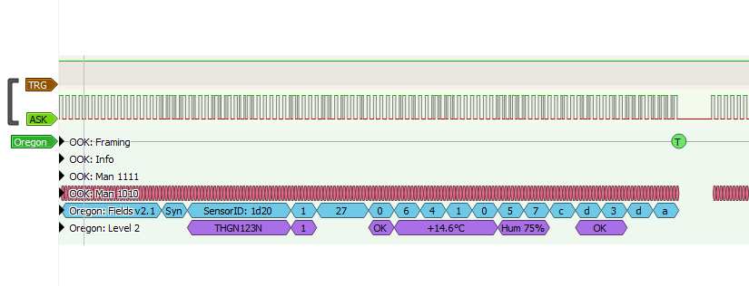
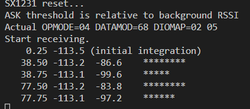
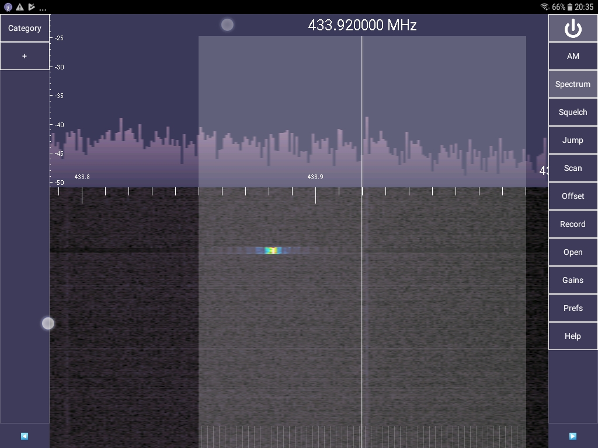

# Intro

This repo captures some of my experiments with an RFM69HCW and Raspberry Pico/Pico Wireless.

I'm probably repeating a lot of work others have done for years, albiet with a Raspberry Pico.

End goal is to build a relay for forwarding Oregon weather sensor transmissions to MQTT using a Pico W, or a Pico with serial.
I had had a system doing this using `rtl_433` with a USB RTL-SDR, but I really didn't want to permanently tie that into my home automation system.
(When I complete the MQTT forwarder I will put that project in a different repo, along with a tutorial for how the decoder works including, the RF side of things.)

# Results

- It is straightforward to use an RFM69HCW module (SX1231H chip) to demodulate Oregon weather sensor 433MHz ISM band transmissions
- These can then be decoded using IRQ sampling of pulses and analysing the time difference between successive rising edges.
- This should be adaptable to experiment with decoding other 'stuff' at 433Mhz using OOK (also known as ASK)
- The Oregon THGN123N temperature and humidity sensor I was testing makes a transmission every apprpximately 39 seconds
- It makes two transmissions each 187ms long with a gap of 10ms between them
- Both are amenable to OOK manchester decoding in Sigrok however the second of this pair consistently always fails to decode as Oregon as there is an extra pulse decoded as binary 0 (short pulse) at the end of the preable

This screenshot shows PulseView successfully decoding a logic analyser capture of DIO2 from the module:

This screenshot shows detections determined by polling the SX1231 RSSI value (using `apps/ook-scope` with only detections printed)

This screenshot shows the spectrum captured using RTL-SDR on Android using SDRTouch - the bandwidth is the white rectangle, 100kHz wide (50kHz either side of 433.92MHz) - and the yellow blob is the transmission, so the vertical axis where the transmission is, is approx 380ms - you can see how if the bandwidth had been only set to 20kHz wide all the energy would have been outside of it. The good thing about this arrangement is that the frequency of the energy can drift and it wont matter.

# Code

The code is a bodged together mix of C and C++, I'm here to play with receivers, decoders and logic analysers not win a clean code contest...

## Demodulator testing

The program `apps/ook-demod` is a tool that will trigger Sigrok when the RSSI passes some threshold.
When this program samples the SX1231 RSSI register and it is above the threshold
(for example, -90dB) it will trigger the logic analyser to capture 400ms, which can be analysed in Pulseview
with the OOK and Oregon decoders if recieving Oregon temperature sensor transmissions.
Run sigrok-cli after the program has started, to ensure the trigger wont glitch on start.

The program `apps/ook-timing` is a tool that will trigger Sigrok when the RSSI passes a set threshold; and also
lower that line when pulses are too long or too short. It uses an IRQ handler to time between both rising and falling
edges on DIO2; Intact manchester coding will have pulses with either 1 or 2 chips width only, where a chip is
(for Oregon 1024 bps) either 1/1024th of a second or 1/2048th of a second. This correctly results in the TRG line
falling low before we get to our 400ms limit, and also between the message pair. You can see in the logic analyser
the exact lag between a transition and TRG; at one point when developing I was accidentally just impulsing the
TRG line, and you could see slight offsets that reflect variability in service time between the IRQ and the code
pulsing TRG. Another thing this highlights is that sometimes the reception is slightly noising, resulting in a long pulse with a very narrow gap and second pulse, this is highlighted by TRG falling briefly mid message. I presume a real system handles this by just discarding the message, or, ignoring extra short gaps or pulses and attempting to continue.

The second message in a pair consistently fails to decode in SigRok because there is always an extra pulse at the end of sync; if you manually inspect the data the remainder is actually correct. I dont know why this is the case.

An interesting observation, is that when the temperature and humidity is the same between transmissions,
the bits are all exactly the same - in my case with T=14.5C and H=75, there was exactly 160 long pulses and 305 short pulses
and the decoded message was identical (unsurprisingly)

The program `apps/ook-scope` is a tool that samples and produces data that can be used to chart the RSSI over time. When the signal is sufficient, this should correlate with the DIO2 output. It is basically an implementation of the concept described FIXME. With some work this could be used to produce a continuous chart of RSSI and plot detections over a longer period, useful for identifying other nearby transmitters by analysing the intervals.

The program `apps/oregon-decode` is hacked together from https://github.com/Cactusbone/ookDecoder which is a fork of https://github.com/phardy/WeatherStation, to decode the manchester coding and the packet values. One thing I noticed, is that the hex numbers are completely different from what PulseView shows, even though the end result is the same... oddly so far when I run this, it will pickup other junk packets, and for some reason every second, or two of three, packets are corrupted (this is packets on the 39s cadence) that otherwise are fine in Pulseview, so I think there might be a bug in the decoder (maybe on reset) - indeed there are some compiler warnings in relation to unused or invalid `switch` `case`'s so that might be a clue...

## License

- because it uses RadioHead, the code I wrote is also released under GPL3.0
- other code that was copied remains under whatever license it was supposed to be
# References

I found these very useful:

- Oregon protocol reference, including oscilloscope images of Oregon OOK manchester coding
- this blog JEELABS gave me the inspiration for the example that dumps RSSI vs time, amongst others
- this blog FIXME was xxx

# Environment

I setup my environment on a Raspberry Pi 400 as per https://datasheets.raspberrypi.com/pico/getting-started-with-pico.pdf, using the quickstart method. As a result my SDK was in ~/pico/pico-sdk and `PICO_SDK_PATH` was set in `~/.bashrc`

If you are starting like this, simply cd to this repository, and run `bootstrap-cmake.sh` which will also clone any missing repositories this project depends on. These include:

- arduino-compat - this is needed to fake RadioHead into working
- RadioHead - library that includes support for the RFM69HCW

## How to simply use arduino-compat in your own project

- clone it to a subfolder - in this case, I cloned to `lib/compat`
- populate the submodule of it `arduino-compat/arduino-pico`
- you can see both of those operations in `bootstrap.sh`
- build it from cmake before your other programs, using a different sub-build directory
- you can see this as `add_subdirectory(../lib/compat/arduino-compat build_ac)` in `apps/CMakeLists.txt`
- in the project itself, add `arduino-compat` as a target library
- in the code, start with `#include "Arduino.h"` before `#include "pico/stdlib.h"`

## How to use RadioHead in your own project

- first, integrate `arduino-compat` as above
- fetch RadioHead source zip from the developer
- unzip it to a subfolder - in this case, I unpacked to `lib/RadioHead`
- you can see both of those operations in `bootstrap.sh`
- create a CMakeLists.txt file in `lib/` that can be imported to build a library with the RadioHead code
- in this project, it is called `lib/RadioHead.cmake`
- this should build an `INTERFACE` library with the minimum number of RadioHead files needed to support our application
- include the file `RadioHead.cmake` in one place
- in the project itself, add that as a target library
- in the code, start with `#include "Arduino.h"` before any RadioHead includes

# Other tools

## Pi400

I used this to develop the code, using Visual Studio in remote mode over ssh from various other systems.

Additionally, I used the pi400 GPIOs to reprogram the Pico using SWD (so I didn't have to do the annoying unplug/replug the USB while holding the BOOTSEL button juggle every time I wanted to relfash it) and to access the serial port, freeing the pico USB for other experiments.

## Logic Analysers

I have an 8 channel AX-Bee USB logic analyser which is probably a clone of a Saelea clone. Under the hood it almost certainly uses a Cypress PSOC. It is supported by Sigrok, which can be used to take captures which can then be analysed with a graphical tool called Pulseview. These all work on Linux, Windows and Mac. In my case I used the logic analyser on the same pi400 I was programming the Pico with; the logic analyser is not smart enough to cope with multiple transition or A-then-B triggers. I have a Hantek which can do that but I didnt need it in the end, luckily I was able to fake it by computing the complex trigger in the Pico code when I needed it and using an extra GPIO output...

Pulseview works very well for stacking decoders - so once it detected and decoded the OOK as Manchester, it easily decoded Oregon protocol to confirm I had it right.

The Logic Analyser is also useful for debugging the SPI comunication - although it seems every time SPI hasn't worked it turned out I had MISO and MOSI connected backward...

## Spectrum Analysers

At various times I used a couple of USB RTL-SDR modules, one with SDRSharp from an old Windows laptop, and the other on an old Android tablet using SDR Touch with a purchased key.

If you want to get started with SDRSharp, see https://airspy.com/downloads/SDRSharp_The_Guide_v3.0_ENG.pdf.
The trick is to first run the 'RTL SDR' installer batch script, after that the then the Zadig program, and make sure that the thing that shows up in device manager as `Bulk In, Interface (Interface 0)` has the driver WinUSB reinstalled to it. It can b e confusing because when you select ' RTL SDR' in SDR sharp there are no other options in the device panel to let you know it is found; until you hit play.

# Journey

After skimming the SX1231 chip manual, I munged together Arduino-compat, Radiohead and the example from FIXME BLOG to try and visualise the DIO2 OOK output using Sigrok. The output I however I observed as just a series of spikes, which didnt make sense, and didnt look lilke the oscilloscope images from FIXME blog. I spent a lot of time mucking around, eventually finding the FIME BLOG where I worked in my own version of an RSSI sampling dump, the results of which still didnt make sense. I managed to work out that it was impossible to sample at a 25uS rate, given the SPI read takes longer than that, confirmed once I was outputting another GPIO to Sigrok showing the run time was longer than calculated. I empirically worked out that the sampling interval needs to be at least 64uS, agter which I was starting to get a better picture. Ultimately I didn't need the dump any more because I just mapped the RSSI to below or above threshold to visualise on Pulseview. I spent a lot of time playing with thresholds and SX1231 settings. Afteer a break I fired up a spectrum analyser using an RTL and at that point I realised I was forgetting a bunch of basic RF energy stuff (see below) and as soon as I significantly increased the demodulator bandwidth, Pulseview was able to deoce the OOK Manchester data and the Oregon protocol! From there I created all the tidied up code samples, and then implemented further experiments with OOK decoding.

# Various Thoughts TL;DR

## Pico  & Pico Wireless

The Pico has been out around a couple of years, and I never really took a close look for various reasons, until the W became available the week before, and for $9AUD presents excellent value. My go-to had been the teensy, albiet expensive-ish, and the ESP8266 for various experiments, as I had both of these hanging around. The Pico-W simplifies a bunch of things I am working toward by incorporating Wifi and with some luck the ability to do over the air (OTA) updates on Wifi, even if I dont need the wifi for the application; this makes things much easier doing remote development (remote, as in the gadget is 50 meters away from the house, in a yard, under a brick or up a pole, even if cabled for power and using Lora for transmit, and I'm still trying to perfect the software)

Pico programming has a number of modes: C/C++ SDK with strong CMake integration, MicroPython, and in still-being-completed forms an Arduino core. There are platform.io integrations for both the SDK and the Arduino Core. There is also support now in frameworks including FreeRTOS; indeed this latter is necessary to support some of the more advanced Wifi (Internet) applications.

The Pico-W is almost, but not quite the same as the Pico. Important differences:
- the default LED is not attached to a Pico GPIO, rather it is connected via the Wifi chip
- the examples in pico-examples are all under a pico_w directory; importantly, so is blink
- code that doesnt use the default LED or any Wifi should just work the same on both
- it is very annoying they didn't add some kind of macro to abstract the on-board LED, although it is not too hard to make your own

I've usually been using Arduino framework with platform.io for most important stuff I've worked on. Arduino does have the advantage of I can have one code base that can be adapted for ESP, teensy, or AVR with minimal effort; but the Raspberry Pico C SDK presents a good abstraction over the bare hardware and the Arduino layer for that is just going to be mostly wrapping it. So I'm trying to see how far I can get without using Arduino. I'm not really looking at the Python mode at this stage, just because I prefer getting back to using C/C++ for this kind of coding. Also there is a lot of Arduino / existing code in C/C++ that should be adaptable.

Speaking of which there is an Arduino to Pico SDK adaptor library that I found on Github and had a play with. This did simplify integrating various Arduino specific stuff running quickly without the full Arduino core. Although it does reuse code from the core, it seems to compile just the essentials and into a form that plays nicely with a mainly-SDK based project.

## OOK, RF energy and bandwidth

433MHz ISM band transmitters will typically have a notional transmit frequency; for example the Oregon is 433.92 MHZ.  However, the actual transmission will be centered at at frequency offset to that notional frequency, the amount depending on all manner of variables known and unkwown, including temperature, robustness of the electronics, or which way the wind is blowing, who knows. Luckily this doesnt matter, because the transmission uses OOK - on off keying - which is just pulses made from a burst of RF energy. You could almost say it is like a CW signal that is off almost all the time, except for when it is pulsing, and due to the square-wavy nature of things there can be some spread of harmonics. 
What this means, is you can't just tune to 433.92 MHz and expect to see a signal; however by setting the bandwidth to say 100kHz each side, and using a simple detector that essentially just sums the energy in the band, you can "hear" the pulses.

This can be demonstrated by even using something like a Baofeng UV-5RA+ (of which I have one) tuned to 433.92 Mhz with the monitor bandwidth  at FM (not Narrowband FM), and listening for a short "fuzz" sound occuring every say 35-40 seconds when you have an Oregon temperature sensor in the vicinity. 

`insert spectrum picture here`

The OOK transmissions are usually coded with something called Manchester encoding.

I you dont get the bandwidth wide enough to encompass the transmission, this just plain fails.

## RFM69HCW

A lost of existing projects use superheterodyne 433MHz receivers which provide demodulated analogue (i.e. digital pulse) output which is typically connected to a GPIO and then decoded using interrupt based timing of spaces between pulses.

There is nothing wrong with this, although it is nothing but the raw signal. Previously I've done a lot of work with SX1276 915Mhz Lora modules, and the RFM69HCW operates at 433MHz using an SX1231 which is a similar SPI based chip, which supports an OOK mode (the SX12767 also has an OOK mode) and I wondered if might be adapted to receive Oregon 433MHz OOK.

This question was the basis for this experimental repository, and it turns out it can, although not in the obvious way. In particular, the RFM69HCW ends up pbeing used as a much more stable, instrumented, digitally controlled, and slightly more expensive replacement for a typical superhet module. It can be placed into OOK mode and the raw OOK pulses output on a digital I/O pin and fed to the microcontroller for IRQ based timing decoding... (beyond this, it can in-chip decode OOK sent by other chips in the right coding and formatting, of which the Oregon weather station is not sending...) other advantages is that the OOK pulse stream is clean and digital, and the chip also measures RSSI, etc. 

In any case I had the RFM69HCW handy. There were few examples even attempting to do what I wanted to do; some pundits on the Internet on various forums gave others advice not to try this, but from my reading of the datasheet, it should be possible (as it turned out to be!)
As an aside, I really dislike how on many forums, there are so many who just tell others their use case is wrong, when a question is well phrased and specific. One should not have to state 'I want to try and do it this way, because I can, because it is cheap, or because I have this item in my junk box' to justify a question. Maybe it is impossible, but so often, I've come across this attitude when I know from my own work or other reading that the question was answerable. I also dislike how so many on the Internet just state flat out wrong information based purely on their own narrow experience, without qualifying it as such. The success of these experiments is a middle finger to both those groups :-)

